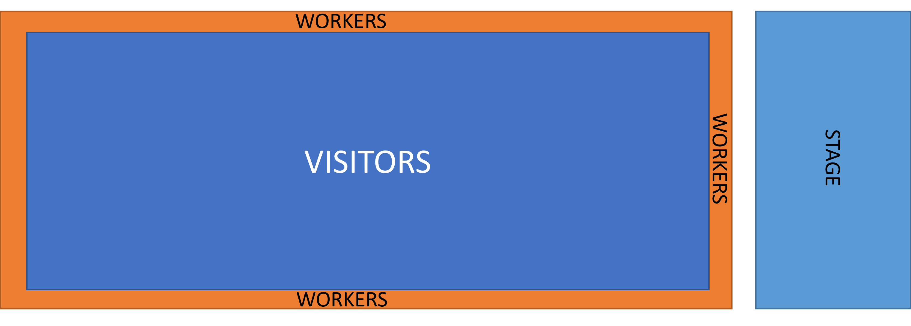

# Project ABM, Optimal Positioning of First-Aid Responder

Project Ulas Demirtas

This model will help answer the question of what is the optimal positioning of placing first-aid workers during a concert in the Ziggo dome. This will be answered by simulating a crowd, with crowdlike behaviour and placing "accidents" scattered throughout the concerthall.

There will be two kinds of agents, visitors and first-aid workers. These will be placed in the concerthall. The concerthall consists of two areas. A large rectangle where the visitors will be placed, and an outer perimeter around the rectangle where the first-aid workers will be placed. When an accident occurs, the closest first-aid worker will try to get there as quickly as possible. Which first-aid worker gets chosen will be fine tuned as the model comes along.

The visitors are defined by their location in the concert hall and how they act. Most of the visitors will want to get as close to the stage as possible. They will want personal space around them, however getting closer to the stage can be prioritized over the personal space. There will also be some visitors that prioritize their personal space more so they will stay behind.

The minimal viable product is a crowd with a linearly decreasing space between visitors as the distance to the stage decreases. The first aid workers can then wiggle, and push their way to the accidents. The time spent walking towards the accident will then be averaged and saved according to the location of the first-aid worker. This way at the end a heatmap of the outer perimiter with their locations can be created.

Click the picture under for a visual demonstration

